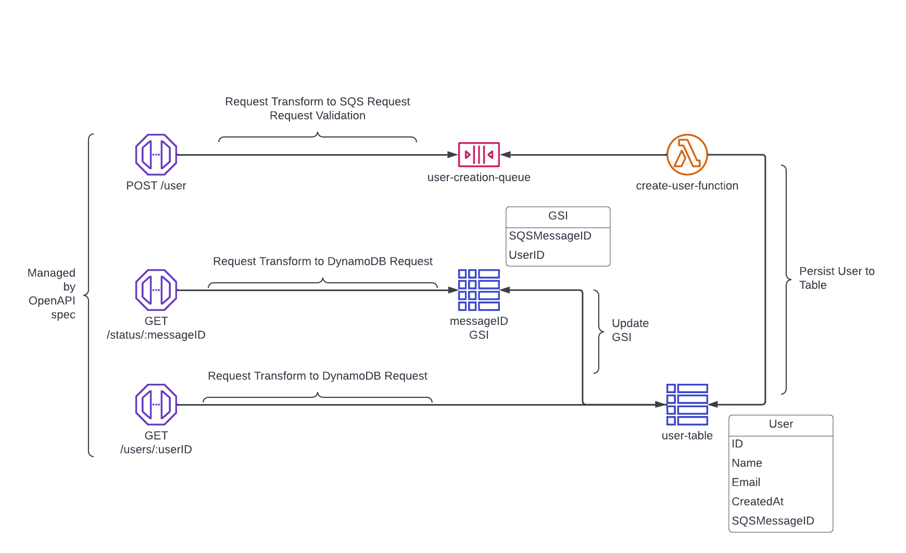

# AWS Serverless Async API

This is intended to be a reference architecture for a simple asynchronous API leveraging AWS Serverless infrastructure.

## Design

The design incorporates AWS serverless architecture to demonstrate a create and retrieval flow for a simple "user" entity.
The intention is to leverage existing AWS services in order to provide a highly-available API.

### API Service Integrations

Utilization API Gateway Service Integrations, we can minimize the need for Lambdas and the cold-starts, as well as overhead, that comes with the "typical" serverless API.
Service Integrations can use API Gateway request transformations and directly call AWS services.
Requests can also be validated using API Gateway.
Security can still be handled at the API layer and leverage AWS IAM or JWT as with other architectural patterns.
The API Gateway design can be managed through an OpenAPI specification.

### Asynchronous Processing

Funnelling creation requests directly to an SQS queue leverages the high-availability of SQS and "hides" potential cold-starts from Lambda.
This pattern allows for a quicker response to the client with a MessageID ack that can be used to poll using a GET request.
The client is provided a GET endpoint to poll with the provided SQS MessageID.
When a UserID is returned, then a GET request can be made to retrieve the User with the provided ID.

This pattern of having a client polling a status endpoint is not novel, but is unique to many of our existing architectures.
