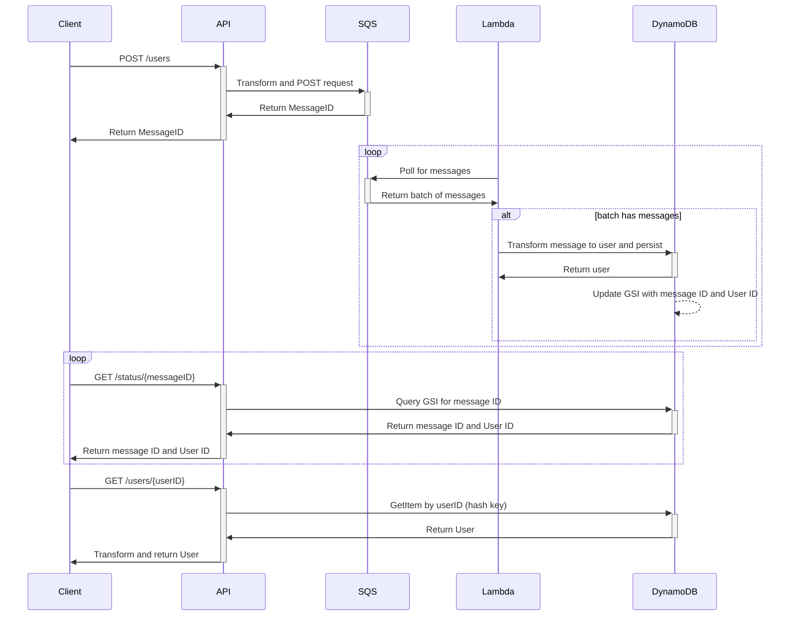
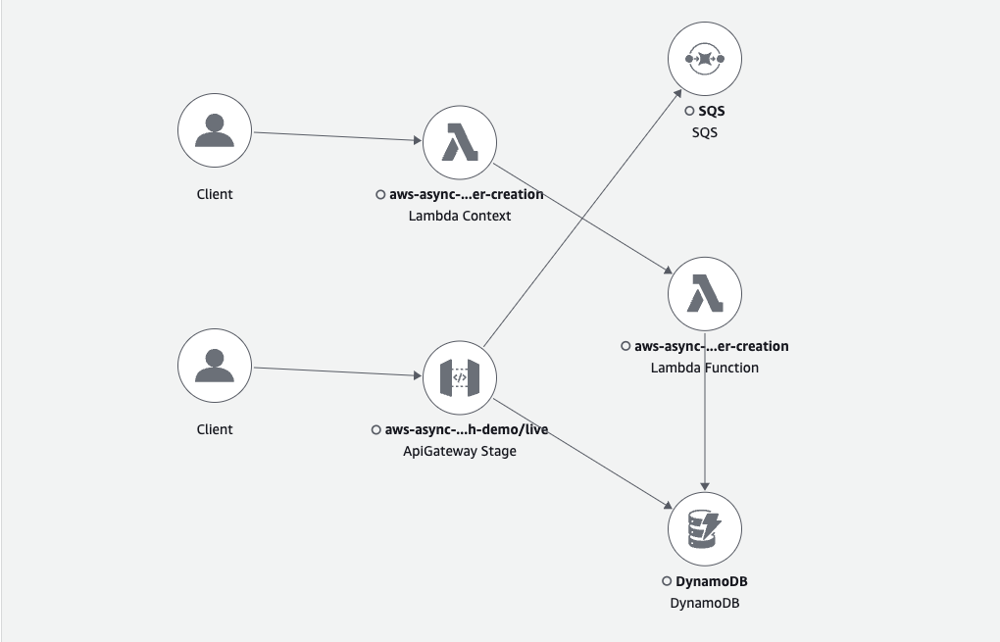
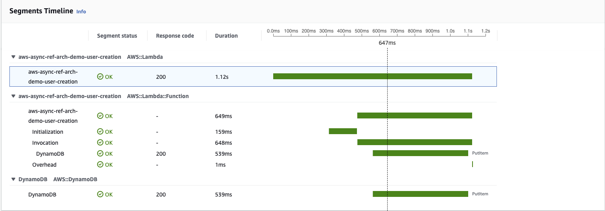

# AWS Serverless Async API

This is intended to be a reference architecture for a simple asynchronous API leveraging AWS Serverless infrastructure.

## Design

The design incorporates AWS serverless components to demonstrate a create and retrieval flow for a simple "user" entity.
The intention is to leverage existing AWS services in order to provide a highly-available API.

I wanted to note that this architecture supports a *very* simple create and retrieval flow for simplicity.
There is no intention of handling entity updates or deletions.
I was looking to explore and highlight the possibility of using AWS service integrations behind an API Gateway
while leveraging asynchronous processing in a queue and with a Lambda.
A more complex design would likely utilize other AWS services like Step Functions or streaming services such as Kafka or Kinesis.

### Sequence Diagram

### API Service Integrations

The majority of use-cases for our Lambda functions that sit behind API Gateway typically involve mapping an API request to an AWS service request.
Utilizing API Gateway Service Integrations we can minimize the need for Lambdas that are a part of the "typical" serverless API.
Moving the Lambdas away from the API Gateway minimizes the impact of cold starts as well as the computational overhead of running Lambda functions.
There are scaling limits for Lambdas that, under high request volume, we can hit which would cause a negative impact to performance for our clients.

Service Integrations can use API Gateway request transformations and directly call AWS services.
Requests can also be validated using API Gateway.
Security can still be handled at the API layer and leverage AWS IAM or JWT as with other architectural patterns.
The API Gateway design can be managed through an OpenAPI specification.
All of these features add up to a more robust API, managed through the OpenAPI spec, with less code (Lambdas).

### Asynchronous Processing

Funnelling creation requests directly to an SQS queue leverages the high-availability of SQS and "hides" potential cold-starts from Lambda.
This pattern allows for a quicker response to the client with a MessageID acknowledgment that can be used to poll using a GET request.
The client is provided a GET endpoint to poll with the provided SQS MessageID.
When a UserID is returned on the status endpoint, then a GET request can be made to retrieve the User with the provided ID.

This pattern of having a client polling a status endpoint is not novel, but is unique to many of our existing architectures.

## Evaluation

### Load Testing

I did not look at load testing the API because of time constraints.
An educated guess regarding performance is that the response times should remain consistently low, so long as we are under any service quotas.
In other words, by excluding Lambda invocations from our API requests, I do not anticipate any fluctuations in latency due to cold-starts or scaling.

### Service Map

Note that it is currently not possible to trace an SQS-to-Lambda invocation because of a limitation with X-Ray in Lambda environments.

### API Response Times

The following table captures the total round-trip response time as measured by AWS X-Ray traces.
The response times of collaborating AWS services is broken out as an individual line item.

| Path                    | Response Times (service) |
|-------------------------|--------------------------|
| POST /users             | 65ms (API Gateway)       |
|                         | 28ms (SQS)               |
| GET /status/{messageID} | 48ms (API Gateway)       |
|                         | 18ms (DynamoDB)          |
| GET /users/{userID}     | 36ms (API Gateway)       |
|                         | 15ms (DynamoDB)          |

### Lambda Processing Times

The following is a trace of the Lambda processing messages in the queue from a cold execution environment.
This duration would be passed to a client if this was performed synchronously through an API Gateway request.

### Pros and Cons of Service Integrations

Who doesn't love a good pro/con list?

| :white_check_mark: Pro                                                                | :x: Con                                                                                                                  |
|---------------------------------------------------------------------------------------|--------------------------------------------------------------------------------------------------------------------------|
| Removing Lambdas and using request and response mappings create a simpler design      | The documentation for how Service Integrations work is very limited                                                      |
| API performance will be more consistent without Lambda invocations                    | The documentation for the OpenAPI extensions is very limited                                                             |
| Asynchronous patterns allow for high availability at the cost of eventual consistency | Apache VTL documentation is very poor and a big part of writing a mapping template                                       |
| Fewer components mean fewer points of failure                                         | Local testing of VTL templates is a challenge: need to run a custom servlet but will be missing any unique AWS functions |
| Leveraging AWS Services provide "out-of-the-box" metrics and tracing                  |                                                                                                                          |
